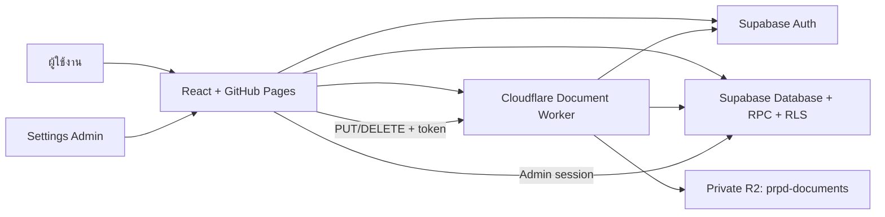

# PRPD Project Handoff

เอกสารนี้สรุปสถานะของระบบ PRPD เพื่อใช้พัฒนาต่อ ตรวจสอบปัญหา หรือส่งต่องานให้ Developer/AI ตัวอื่น โดยอ้างอิง Codebase และ Git history ณ วันที่ **1 กันยายน 2026** ที่ฐาน Commit `dc83edb` (`fix: place clear action before raw material search`)

> เมื่อระบบมีการเปลี่ยนแปลงเชิง Feature, Database, Security, Deployment หรือ Business rule ให้แก้หัวข้อ “การแก้ไขล่าสุด” และส่วนที่เกี่ยวข้องในเอกสารนี้พร้อมกับ Code ทุกครั้ง

## 1. เป้าหมายของแอป

PRPD ย่อมาจาก **Purchase Request and Production Document** เป็น Web Application ของ S Metal Tech สำหรับรวมงานต่อไปนี้ไว้ในระบบเดียว:

- ออกใบขอซื้อวัตถุดิบและวัสดุอุปกรณ์
- แยกใบ PR ตาม Vendor และจัดเลขเอกสารอัตโนมัติ
- เก็บและค้นประวัติ PR
- สร้างและพิมพ์ Work Order
- ค้นหา Preview และพิมพ์ Drawing, Inprocess Check Sheet และ QC Check Sheet
- จัดการ Master Data และไฟล์เอกสารผ่านหน้า Settings ที่จำกัดสิทธิ์
- ย้ายข้อมูลเดิมจาก Google Sheets/XLSX และโฟลเดอร์เอกสารเข้าสู่ Supabase + Cloudflare R2

ระบบสร้างขึ้นเพื่อแทน/รักษา Workflow สำคัญจาก Google Apps Script เดิม โดยเพิ่ม Transaction, RLS, Private file storage, Audit และ Responsive UI

## 2. Technology และบริการที่ใช้

| ส่วน | Technology / Service |
| --- | --- |
| Frontend | React 19, TypeScript, Vite, React Router แบบ Hash Router |
| UI | Custom CSS และ Lucide React icons |
| Database/Auth | Supabase Postgres, Supabase Auth, RLS และ RPC |
| ไฟล์เอกสาร | Cloudflare R2 private bucket `prpd-documents` |
| File gateway | Cloudflare Worker `prpd-document-gateway` |
| Frontend hosting | GitHub Pages |
| CI/CD | GitHub Actions workflow `.github/workflows/deploy-pages.yml` |
| Test | Vitest, Testing Library และ Node test runner สำหรับ Worker |

Production frontend: <https://smetaltech27-bit.github.io/prpd-web/>

## 3. Architecture และ Data flow



หลักสำคัญ:

- Frontend ไม่เก็บ R2 credential และไม่เปิด R2 Public Access
- การอ่านไฟล์ส่ง Supabase access token ไปยัง Worker; Worker ตรวจ JWT และตรวจว่า `storage_path` เป็น Metadata ที่ Active จริงก่อนอ่าน R2
- การ Upload/Delete ไฟล์ต้องเป็น `settings_admin`
- Supabase เก็บข้อมูลธุรกิจ, Metadata, Version และ path ของไฟล์ ส่วน R2 เก็บ Binary object
- GitHub Pages ใช้ Hash Router เพื่อให้ Refresh route ย่อยได้โดยไม่ต้องตั้ง rewrite rule

## 4. Route และหน้าจอหลัก

| Route | หน้าที่ |
| --- | --- |
| `#/raw-material-pr` | ออกใบสั่งขอซื้อวัตถุดิบ |
| `#/equipment-pr` | ออกใบขอซื้อวัสดุอุปกรณ์ |
| `#/work-order` | ออกใบสั่งงานและชุดเอกสารการผลิต |
| `#/print/drawing` | ค้นหา Preview และพิมพ์ Drawing |
| `#/print/inprocess` | ค้นหา Preview และพิมพ์ Inprocess Check Sheet |
| `#/print/qc` | ค้นหา Preview และพิมพ์ QC Check Sheet |
| `#/pr-history` | ค้นหา Export และลบประวัติ PR ตามสิทธิ์ |
| `#/settings` | จัดการ Master Data และ Document Files |

Route และการโหลด Master catalog เริ่มที่ `src/app/App.tsx` ส่วนเมนูหลักอยู่ที่ `src/components/AppShell.tsx`

## 5. Business rules สำคัญ

### 5.1 Raw Material PR

- ผู้ใช้กรอก Item FG, จำนวนที่จะผลิต และ Due Date
- ระบบค้นหา Raw Material ของ Item FG แบบไม่แยกตัวพิมพ์เล็ก–ใหญ่
- ดึงทุกรายการ/ทุก Vendor ที่ตรงกัน แล้วคำนวณจำนวนสั่งซื้อจาก `ceil(จำนวนผลิต / usage)`
- ผู้ใช้แก้ Q’ty, Price, Due Date และ Comment ของแต่ละบรรทัดได้
- Due Date ห้ามย้อนหลังวันปัจจุบันตามเขตเวลา Bangkok
- ปุ่ม “ล้างข้อมูล” ด้านบนล้างเฉพาะ Item FG, จำนวนผลิต และ Due Date โดยไม่ล้างรายการ Raw Material ที่ดึงมาแล้วในตาราง
- ตำแหน่งปุ่มบน Desktop/Mobile เรียง “ล้างข้อมูล” ทางซ้าย แล้ว “ดึงข้อมูล” ทางขวา และไม่มีปุ่มล้างรายการทั้งหมดด้านล่างเพื่อป้องกันการกดพลาด

### 5.2 Equipment PR

- ต้องระบุ Due Date ก่อนเลือก Checkbox ของรายการ
- เมื่อเลือกรายการ ช่อง Price และ Q’ty จะเปลี่ยนเป็นช่องที่แก้ไขได้
- ค้นหาได้จาก Code, Name, Spec และกรอง Vendor ได้
- ปุ่มล้างข้อมูลลบเฉพาะ Selection/State บนหน้าจอ ไม่ลบ Master Data

### 5.3 PR number และการพิมพ์

- รูปแบบเลขคือ `PR-YYMM-NNNN`
- หนึ่ง Vendor ได้หนึ่ง PR; การสร้างหลาย Vendor ในครั้งเดียวทำผ่าน RPC แบบ Transaction
- Preview ยังไม่ถือว่าเป็นประวัติที่ส่งแล้ว
- เมื่อกดพิมพ์ ระบบจองเลข PR ชั่วคราว และเก็บ Draft
- ผู้ใช้ต้องยืนยันว่าพิมพ์แล้วจึงเปลี่ยนเป็น `submitted` และแสดงใน PR History
- หากกลับไปแก้ไข ระบบใช้เลขที่จองเดิมเมื่อเหมาะสมและอัปเดต Draft
- ลำดับเลขใน `private.pr_sequences` ต้องเดินหน้าเสมอ แม้ลบประวัติแล้วก็ห้ามนำเลขเก่ากลับมาใช้
- เอกสาร PR พิมพ์ A4 Landscape สูงสุด 12 รายการต่อหน้า และลายเซ็นอยู่หน้าสุดท้าย

### 5.4 Work Order และเอกสารการผลิต

- ค้นหา Production Item Master แบบไม่แยกตัวพิมพ์เล็ก–ใหญ่
- Work Order ใช้ Item FG, QTY และ Delivery Date เพื่อสร้าง Preview
- ชุดพิมพ์ประกอบด้วย Work Order, Inprocess Check Sheet และ Drawing
- หากเอกสารบางชนิดไม่มี Active asset ระบบแสดง Placeholder ว่าไม่พบไฟล์แทนการล้มทั้ง Flow
- เมนู Drawing/Inprocess/QC รองรับการค้นด้วย Item FG, Part Name หรือ Drawing No.

### 5.5 Item FG และชื่อไฟล์ใน R2

- Item FG ใน Master/Metadata เก็บและแสดงเป็นตัวพิมพ์ใหญ่ เช่น `11223TA`
- Object Key ใน R2 ตั้งใจ Normalize เป็นตัวพิมพ์เล็กและ URL-safe เช่น `inprocess/11223ta/v001/11223ta.jpg`
- Upload ใหม่จาก Settings ใช้ immutable path รูปแบบ `<type>/<item-fg-lowercase>/revisions/<uuid>.<ext>` จึงไม่เขียนทับไฟล์เดิม
- การค้นหา Item FG ใน Supabase ใช้ `ILIKE` หรือ `upper(trim(...))` จึงไม่แยกตัวพิมพ์เล็ก–ใหญ่
- ตอนเปิดไฟล์ Frontend ใช้ `storage_path` จาก Supabase Metadata แบบตรงตัว และ Worker ใช้ path เดียวกันอ่าน R2
- ห้าม Rename/Move Object ใน R2 Dashboard ด้วยมือ เพราะ Metadata จะชี้ path เก่าและทำให้เปิดไฟล์ไม่พบ

## 6. Authentication, Authorization และ Security

- ผู้ใช้งานปกติใช้ Supabase Anonymous Auth เพื่อให้คำขอผ่าน role `authenticated`
- Settings ใช้ Supabase Email/Password ของ Admin แยกจาก Session ปกติ
- หลัง Login Settings ต้องผ่าน RPC `is_settings_admin()`
- Settings session ไม่ Persist และ Lock อัตโนมัติเมื่อไม่มีการใช้งาน 15 นาที
- Invite/Recovery link เปิดหน้า One-time Password Setup และตรวจทั้งอีเมลที่กำหนดกับ Admin role
- Database เปิด RLS; ห้ามใช้ `service_role` ใน Browser, `.env` ที่ขึ้นต้น `VITE_*`, GitHub Pages หรือ Repository
- Worker อนุญาต Origin ตาม `ALLOWED_ORIGINS`, จำกัดชนิด/ขนาดไฟล์ และตรวจ immutable path
- R2 Public Access ต้องคงเป็น Disabled

ข้อจำกัดที่ต้องตัดสินใจก่อนเปิดกว้างสู่อินเทอร์เน็ต: Anonymous Auth ทำให้ผู้ที่เข้าถึงเว็บสามารถเป็น authenticated operator ได้ หากข้อมูล Vendor/ราคา/ประวัติเป็นความลับ ควรเพิ่ม Employee Login/SSO หรือวางระบบหลัง Private gateway

## 7. กติกาการลบข้อมูลล่าสุด

การลบทั้งหมดต้องปลดล็อก Settings และยืนยันข้อความใน Modal ก่อน

### PR History

- ลบได้เฉพาะ PR สถานะ `submitted` ที่เลือก
- ลบทั้ง Header และ Lines ของเอกสารนั้น
- จำกัดสูงสุด 5,000 PR ต่อคำขอ
- ไม่แก้หรือลดเลข Sequence ดังนั้นเลข PR ที่ลบแล้วจะไม่ถูกใช้ซ้ำ

### Raw Material / Equipment Master

- ลบถาวรได้เมื่อไม่มี PR History อ้างอิง Record นั้น
- ถ้ามี History อ้างอิง ระบบปฏิเสธการลบและให้ใช้ “ปิดใช้งาน” แทน เพื่อรักษาความถูกต้องของเอกสารเดิม
- รายการที่ปิดใช้งานสามารถเปิดกลับมาใช้งานได้จาก Settings

### Document Files

- ถ้า Item มาจาก Production Item Master: ลบ Production Item, Document Metadata ทุก Revision และพยายามลบไฟล์จริงใน R2/Supabase Storage
- ถ้า Item มาจาก Raw Material Master: ลบเฉพาะ Document Metadata และไฟล์เอกสาร แต่ **ไม่ลบ Raw Material Master ข้ามเมนู**
- Database จะคืนรายการ `storage_path` ให้ Frontend ส่งต่อไปลบผ่าน Private Worker
- ถ้าลบ Metadata สำเร็จแต่ลบไฟล์จริงบางรายการไม่สำเร็จ UI จะแจ้งจำนวนไฟล์ค้างให้ตรวจ R2; ไม่ควรกล่าวว่าลบครบโดยไม่มีการตรวจผล

Migration ที่เกี่ยวข้อง:

- `202608280001_delete_pr_history.sql`
- `202608310001_delete_settings_records.sql`

## 8. โครงสร้าง Code ที่ควรรู้

| Path | ความรับผิดชอบ |
| --- | --- |
| `src/app/App.tsx` | Routes, Session bootstrap และโหลด Catalog |
| `src/components/AppShell.tsx` | Layout, Sidebar, Settings lock/unlock |
| `src/components/PrBuilder.tsx` | Raw Material/Equipment PR workflow ปัจจุบัน |
| `src/features/pr/` | Types, calculation, pagination, print document และ tests |
| `src/components/DocumentSearch.tsx` | ค้นหา Preview และพิมพ์ Production documents |
| `src/pages/WorkOrderPage.tsx` | Work Order Preview/Print |
| `src/pages/HistoryPage.tsx` | PR History, Excel export และ protected delete |
| `src/pages/SettingsPage.tsx` | Master Data, Production Item และ Document management |
| `src/services/prpdRepository.ts` | Supabase queries/RPC และ mapping |
| `src/services/documentStorage.ts` | สร้าง immutable R2 path และเรียก Worker อ่าน/เขียน/ลบไฟล์ |
| `src/services/settingsAccess.ts` | Settings login, role check และ inactivity lock |
| `cloudflare-worker/src/index.js` | Private R2 gateway, JWT/RLS check, upload/read/delete |
| `supabase/migrations/` | Schema, Functions, RLS และ Feature migrations ตามลำดับ |
| `docs/data-migration.md` | Runbook สำหรับ Legacy import และ Security |

หมายเหตุ: มี `src/features/pr/PrBuilder.tsx` ซึ่งเป็น Builder รุ่น Component-oriented เดิม แต่ Route Production ปัจจุบันใช้ `src/components/PrBuilder.tsx` อย่าแก้ผิดไฟล์โดยดูจากชื่อเพียงอย่างเดียว ให้ตาม Import จาก `src/app/App.tsx` ก่อนเสมอ

## 9. Database objects หลัก

- `vendors`
- `raw_materials`
- `factory_supplies`
- `production_items`
- `document_assets`
- `purchase_requests`
- `purchase_request_lines`
- `profiles`
- `audit_logs`
- `private.pr_sequences`

RPC สำคัญประกอบด้วยการค้น Master/Document, จองและยืนยัน PR, จัดการ Production Item, ตรวจ Admin role และ protected delete รายละเอียดจริงต้องตรวจ migration ล่าสุดเสมอ ห้ามอ้างจากชื่อ Function หรือเอกสารเก่าเพียงอย่างเดียว

## 10. Environment และ Secret handling

Frontend ต้องการ:

```text
VITE_SUPABASE_URL
VITE_SUPABASE_PUBLISHABLE_KEY
VITE_SETTINGS_ADMIN_EMAIL
VITE_DOCUMENT_WORKER_URL
```

GitHub Actions อ่านค่าเหล่านี้จาก Repository Variables ส่วน Local ใช้ `.env.local` ซึ่งห้าม Commit

Worker ใช้:

- R2 binding `DOCUMENTS` → bucket `prpd-documents`
- `SUPABASE_URL`
- `SUPABASE_PUBLISHABLE_KEY` เป็น Worker secret/variable ที่ต้องตั้งใน Cloudflare
- `ALLOWED_ORIGINS`
- `MAX_UPLOAD_BYTES` ปัจจุบัน 25 MB

ห้ามบันทึก Password, OTP, Service Role key, R2 API token หรือข้อมูล Generated import ที่มี Vendor/ราคา/Local paths ลง Git หรือเอกสารนี้

## 11. Local development และการตรวจคุณภาพ

```bash
npm install
copy .env.example .env.local
npm run dev
```

ก่อน Commit/Deploy ให้รัน:

```bash
npm run check
```

คำสั่งนี้รันตามลำดับ:

1. Frontend/unit/UI tests ด้วย Vitest
2. Worker tests
3. TypeScript build + Vite production build
4. Supabase migration static checks

สถานะล่าสุด ณ Commit `dc83edb`: Frontend 47 tests และ Worker 6 tests ผ่าน โดย Vite มีคำเตือน Bundle JavaScript ใหญ่กว่า 500 kB ซึ่งยังไม่ทำให้ Build fail

การทดสอบ Database migration แบบ Static ไม่แทนการ Apply กับ Disposable/Staging Postgres การแก้ SQL ต้องทดสอบสิทธิ์ RLS และ Transaction บน Staging ก่อน Production

## 12. Deployment

### Frontend

- Push เข้า Branch `main`
- GitHub Actions รัน `npm ci` และ `npm run check`
- เมื่อผ่านจึง Deploy `dist/` ไป GitHub Pages
- Workflow: `.github/workflows/deploy-pages.yml`

### Supabase

- Apply migration ตามชื่อไฟล์จากเก่าไปใหม่
- ต้อง Backup และทดสอบบน Staging ก่อน Production
- การแก้ Schema/RLS/RPC เป็นงานเสี่ยงและต้องได้รับอนุมัติโดยชัดเจน

### Cloudflare Worker

- Config อยู่ที่ `cloudflare-worker/wrangler.jsonc`
- การเปลี่ยน Worker ต้องรัน Worker tests และ Deploy แยกจาก GitHub Pages
- ห้ามเปลี่ยน R2 bucket binding, Origin, Secret หรือ Security rule โดยไม่ตรวจผลกระทบ

## 13. การแก้ไขล่าสุด

เรียงจากใหม่ไปเก่า:

| Commit | การเปลี่ยนแปลง |
| --- | --- |
| `dc83edb` | สลับตำแหน่งปุ่มหน้า Raw Material PR ให้ “ล้างข้อมูล” อยู่ซ้ายและ “ดึงข้อมูล” อยู่ขวา พร้อม Test ยืนยันลำดับ |
| `cb5060b` | ย้ายปุ่มล้างข้อมูลขึ้นมาไว้ข้างปุ่มดึงข้อมูล ให้ล้างเฉพาะ Item FG/จำนวนผลิต/Due Date โดยคงรายการที่เลือกไว้ และนำปุ่มล้างรายการทั้งหมดด้านล่างออก |
| `4bb64e2` | เปลี่ยนชื่อเมนู “ใบสั่งงาน” เป็น “ออกใบสั่งงาน” |
| `f06f9ff` | เปลี่ยนชื่อเมนู Raw Material และ Equipment เป็น “ออกใบสั่งขอซื้อวัตถุดิบ” และ “ออกใบขอซื้อวัสดุอุปกรณ์” |
| `c7b20cc` | เพิ่ม protected delete ใน Settings ทั้ง Master และ Document Files พร้อมกติกาไม่ลบ Raw Material Master จากเมนูเอกสาร |
| `2d8328a` | เพิ่มการลบ PR History แบบเลือกหลายรายการสำหรับ Settings Admin โดยไม่ย้อนเลข Sequence |
| `af8ec7e` | ปรับความกว้าง Modal เพิ่ม Production Item/Document ให้เหมาะกับเนื้อหา |
| `9c91e88` | ลดขนาด Card อัปโหลดเอกสารให้กระชับ |
| `6344874` | จัดตำแหน่ง Production Item Modal ให้อยู่กลางหน้าจอ |
| `b2c7f73` | ขยายพื้นที่ Settings และ Modal เพื่อใช้งานกับข้อมูลจำนวนมาก |
| `47095f9` | เพิ่มการเปิดใช้งาน Master item ที่ถูกปิดกลับมาใหม่ |
| `547988f` / `fe4cada` | ปรับโครงสร้างและพื้นที่ตาราง Settings |
| `ed918de` | Export PR History ที่กรองแล้วเป็น Excel |
| `572a91a` / `6c5a378` | ปรับหัวตาราง Equipment PR และการอ่านตาราง Raw Material |
| `41fda1f` | เพิ่มปุ่มล้างข้อมูลหน้า Work Order |
| `ca019f7` | กำหนด Bottom print margin ของ Inprocess เป็น 4 mm หลังปรับทดสอบหลายรอบ |

ดูประวัติเต็มด้วย `git log --oneline` และอ่าน Diff/Migration ของ Commit ที่เกี่ยวข้องก่อนแก้ต่อ

## 14. Known risks และงานปรับปรุงที่ควรพิจารณา

1. JavaScript bundle ปัจจุบันมีคำเตือนเกิน 500 kB; พิจารณา Route-level dynamic import/code splitting เมื่อจะปรับ Performance
2. GitHub Actions แสดงคำเตือน Action runtime Node.js 20 บางตัวถูกบังคับรันบน Node.js 24; ควรติดตามและอัปเดต Action major version เมื่อผู้ให้บริการรองรับ
3. Anonymous Auth เหมาะกับ Flow ไม่มี Login แต่ไม่ใช่การจำกัดผู้ใช้ระดับองค์กร
4. R2 upload และ Supabase Metadata insert ไม่ใช่ Transaction เดียวกัน จึงมีโอกาสเกิด Orphan object เมื่อ Upload สำเร็จแต่ Metadata fail
5. การลบ Metadata สำเร็จก่อนลบ R2 อาจเหลือไฟล์จริงค้าง ต้องตรวจข้อความ Partial failure
6. Generated migration/import artifacts มีข้อมูลธุรกิจและ Local paths ต้องคงอยู่ใน `.gitignore`
7. Modal ใหม่หรือ Modal ที่แก้ต้องทดสอบ iPhone Safari/Chrome, toolbar ย่อ/ขยาย, Portrait/Landscape และ Safe Area ตามมาตรฐานโปรเจกต์

## 15. Checklist สำหรับ Developer/AI ที่รับช่วงต่อ

1. อ่าน `README.md`, เอกสารนี้ และ `docs/data-migration.md`
2. ตรวจ `git status` และรักษาการแก้ไขเดิมที่ยังไม่ Commit
3. ตาม Route → Import → Service/RPC จริงก่อนแก้ ห้ามเดาจากชื่อไฟล์
4. ตรวจ Migration ล่าสุดและ RLS ก่อนแก้ Data flow/Auth/Delete
5. รักษา Business rule ของ PR number, print confirmation, Raw Material cross-menu delete และ immutable R2 path
6. ห้ามเปิดเผย Secret หรือ Commit `.env.local`/generated imports
7. เพิ่มหรือแก้ Test ให้ตรง Feature แล้วรัน `npm run check`
8. ถ้าแก้ Database/Worker ให้ทดสอบ Target นั้นแยกและ Deploy ตามลำดับที่ปลอดภัย
9. หลังแก้ Code และตรวจผ่าน ให้ Commit, Push `main`, รอ GitHub Pages Workflow สำเร็จ และตรวจ Production ตามคำสั่งประจำของเจ้าของโปรเจกต์
10. อัปเดตหัวข้อ “การแก้ไขล่าสุด” ในเอกสารนี้เมื่อมีการเปลี่ยนแปลงสำคัญ
